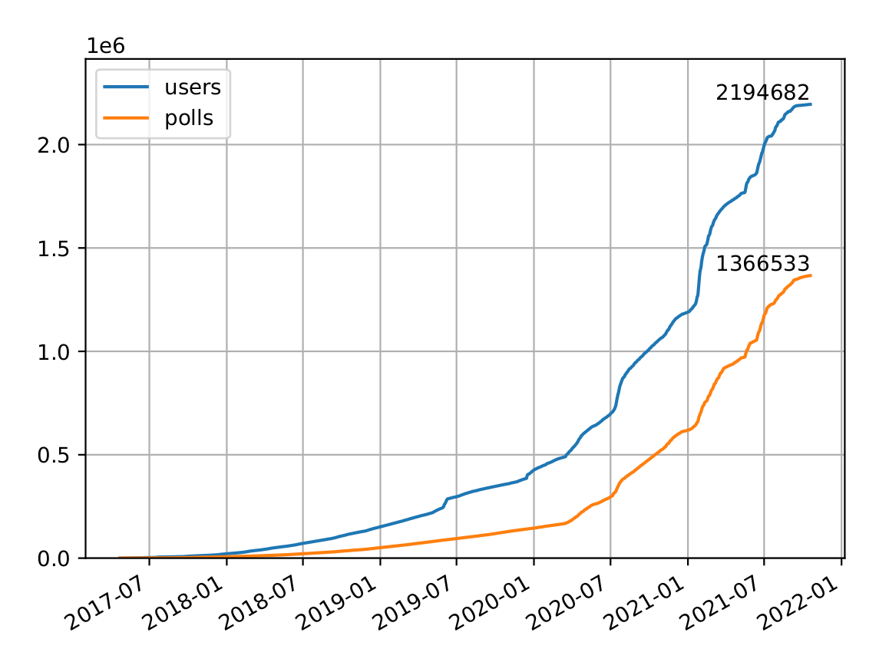

# pollrBot
[](https://www.paypal.com/cgi-bin/webscr?cmd=_s-xclick&hosted_button_id=Q43CKDHGRVSML)
[](https://commerce.coinbase.com/checkout/6bf4d01e-c638-41d9-9ac2-4a2aaf1beba9)

This is a telegram bot that helps by creating inline polls in telegram chats
without spamming multiple messages.

It is online and can be used at [@pollrBot](https://telegram.me/pollrBot).

The bot uses inline queries and feedback to inline queries, which have to be
enabled with the telegram [@BotFather](https://telegram.me/BotFather).

## Usage
The bot can be installed with
```
go get github.com/jheuel/pollrBot
```
if you have a working Go environment.


After that you can run the bot with
```
URL="https://pollr.yourdomain.com" DB="database.db" APITOKEN="euiaeouiaouiao" pollrBot
```

## Statistics of pollrBot
Here are some numbers about how many users interacted with my instance of the
pollrBot and how many polls were created. The instance is running next to a few
other things on the smallest droplet you can get from digitalocean.com.


